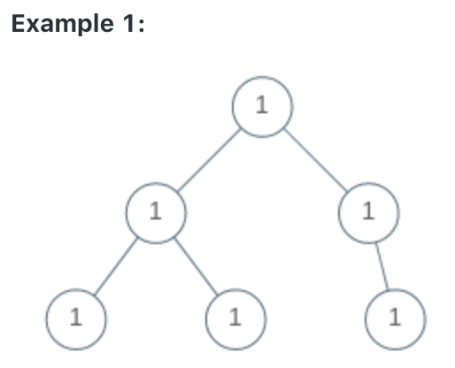
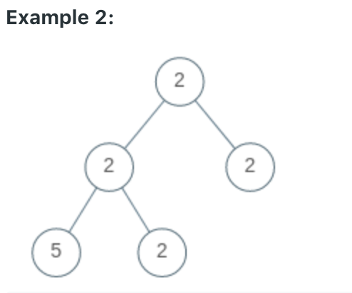

# LeetCode
- [Univalued Binary Tree](#univalued-binary-tree)
- [Valid Parentheses](#valid-parentheses)


# Univalued Binary Tree
Problem: https://leetcode.com/problems/univalued-binary-tree/ 

Description: \
A binary tree is univalued if every node in the tree has the same value. \
Return `true` if and only if the given tree is univalued.

Examples:



```
Input: [1,1,1,1,1,null,1]
Output: true
```



```
Input: [2,2,2,5,2]
Output: false
```

# Valid Parentheses
Problem: https://leetcode.com/problems/valid-parentheses/

Description: \
Given a string containing just the characters '(', ')', '{', '}', '[' and ']', determine if the input string is valid.

An input string is valid if:
    > Open brackets must be closed by the same type of brackets.
    > Open brackets must be closed in the correct order.

Note that an empty string is also considered valid.

Examples:

```
Input: "()"
Output: true
```

```
Input: "[{({[[[()]]]})}]"
Output: true
```

```
Input: "([)]"
Output: false
```