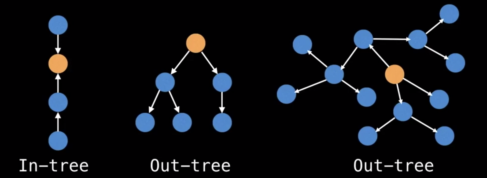
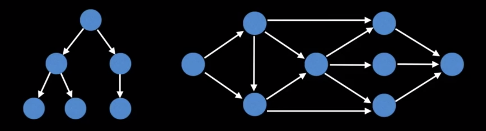
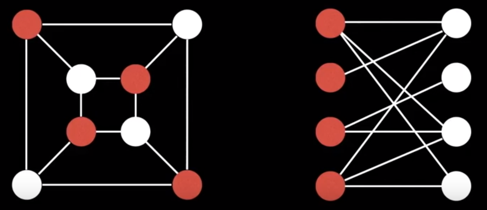
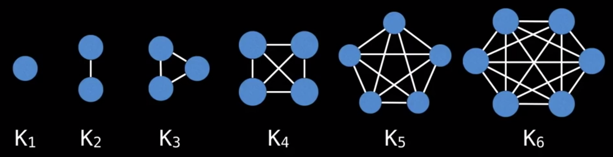

# Graphs
This directory contains the Python implementation of the Graph Data Structure. Included are two testing scripts, `test_graph.py` and `unittest_graph.py` (see below for usages), that can be used to view/test the functionality of the implemented methods.

In addition to the provided test scripts, `word-ladder-problem.py` has been included to showcase the Graph DS usage to solve the famous [Word Ladder Problem](https://en.wikipedia.org/wiki/Word_ladder).

# Usage

## Manual Tests
These tests can be used to visualize various operations performed on the implemented Graph.
```
$ python3 test_graph.py --help
usage: test_graph.py [-h] [--test-all] [--test-add] [--test-bfs] [--test-dfs]

optional arguments:
  -h, --help  show this help message and exit
  --test-all  Runs all tests for the Graph's Functionality
  --test-add  Tests the functionality of Graph.add_edge() &
              Graph.add_all_edges()
  --test-bfs  Tests the functionality of the Graph's Breadth First Search
  --test-dfs  Tests the functionality of the Graph's Depth First Search
```

## Unittests
These unittests can be run to verify the functionality of the implemented Graph and associated methods. 
```
usage: unittest_graph.py [-h] [-v] [-q] [--locals] [-f] [-c] [-b]
                         [-k TESTNAMEPATTERNS]
                         [tests [tests ...]]

positional arguments:
  tests                a list of any number of test modules, classes and test
                       methods.

optional arguments:
  -h, --help           show this help message and exit
  -v, --verbose        Verbose output
  -q, --quiet          Quiet output
  --locals             Show local variables in tracebacks
  -f, --failfast       Stop on first fail or error
  -c, --catch          Catch Ctrl-C and display results so far
  -b, --buffer         Buffer stdout and stderr during tests
  -k TESTNAMEPATTERNS  Only run tests which match the given substring

Examples:
  unittest_graph.py                           - run default set of tests
  unittest_graph.py MyTestSuite               - run suite 'MyTestSuite'
  unittest_graph.py MyTestCase.testSomething  - run MyTestCase.testSomething
  unittest_graph.py MyTestCase                - run all 'test*' test methods
                                       in MyTestCase
```                                       

## Word Ladder Problem
Included in this directory is a sample file of words (`default_word_ladder.txt`) in the required format. You may view a sample of the programs execution by running:
```
$ python3 word-ladder-problem.py --run-example
```

Once you become familiar with the expected format of the file/input, you may utilize the corresponding flags to provide your own puzzle with `src` and `dst` words to view its viability!
```
$ python3 word-ladder-problem.py --help
usage: word-ladder-problem.py [-h] [--run-example] [-f FILE] [-s SRC] [-d DST]

optional arguments:
  -h, --help            show this help message and exit
  --run-example         Runs sample iteration using provided file and SRC
                        (FOOL)/ DST(SAGE)
  -f FILE, --file FILE  Input file containing valid words used to build Graph
  -s SRC, --src SRC     Source KEY (word) to begin the ladder
  -d DST, --dst DST     Destionan KEY (word) to complete the ladder
```

# Notes

# Types of Graphs
- **Undirected Graph**: A graph in which edges have no orientation. The edge (u,v) is identical to edge (v,u)

- **Directed Graph**: (Digraph) graph in whcih the edges have orientation. For example, the edge  (u,v) is the edge FROM `u` TO node `v`.

- **Weighted Graph**: Many graphs can have edges that contain a certain weight to represent an arbitrary value such as cost, distance, quantity, etc...
   - Can come in directed/undirected types

- **Trees**: Undirected graph with NO cycles. Equivalently, it is a connected graph with N nodes and N-1 edges.

- **Root Tree**: Is a tree with a designated root node where every edge either points away or towards the root node. When edges point away fro the root, the graph is called an arborescence (*out-tree*) and anti-arborescence (*in-tree*) otherwise.

   *> Rooted Tree(s)*
   

- **Directed Acyclic Graphs (DAGs)**: Directed graphs with no cycles. These graphs play an important role in representing structures with dependencies. (Example: Schedulers, Course Prerequisites, etc...)
   - Side Note: All *out-trees* are *DAGs* BUT not all *DAGs* are *out-trees*
   - Related Algorithsm:
      - Finding shortest Path
      - Topological ordering of nodes

   *> Directed Acyclic Graph(s)*
   

- **Bipartite Graph**: One whose vertices can be split into two independent groups `U` and `V` such that every edge connects between `U` and `V`. 
   - Common related questions:
      - What is the maximum matching we can create on a bipartite graph?
         - Example: Given the image below, if we assume red nodes are people and white notes are jobs, how many matches can we great with this given bipartite graph?

   *> Bipartite Graph(s)*
   

- **Complete Graph**: Graph where there is a unique edge between every pair of nodes. A complete graph with `n` vertices is denoted as the graph 

   *> Complete Graph(s)*
   