# Graphs
This directory contains the Python implementation of the Graph Data Structure. Included are two testing scripts, `test_graph.py` and `unittest_graph.py` (see below for usages), that can be used to view/test the functionality of the implemented methods.

In addition to the provided test scripts, `word-ladder-problem.py` has been included to showcase the Graph DS usage to solve the famous [Word Ladder Problem](https://en.wikipedia.org/wiki/Word_ladder).

# Usage

## Manual Tests
These tests can be used to visualize various operations performed on the implemented Graph.
```
$ python3 test_graph.py --help
usage: test_graph.py [-h] [--test-all] [--test-add] [--test-bfs] [--test-dfs]

optional arguments:
  -h, --help  show this help message and exit
  --test-all  Runs all tests for the Graph's Functionality
  --test-add  Tests the functionality of Graph.add_edge() &
              Graph.add_all_edges()
  --test-bfs  Tests the functionality of the Graph's Breadth First Search
  --test-dfs  Tests the functionality of the Graph's Depth First Search
```

## Unittests
These unittests can be run to verify the functionality of the implemented Graph and associated methods. 
```
usage: unittest_graph.py [-h] [-v] [-q] [--locals] [-f] [-c] [-b]
                         [-k TESTNAMEPATTERNS]
                         [tests [tests ...]]

positional arguments:
  tests                a list of any number of test modules, classes and test
                       methods.

optional arguments:
  -h, --help           show this help message and exit
  -v, --verbose        Verbose output
  -q, --quiet          Quiet output
  --locals             Show local variables in tracebacks
  -f, --failfast       Stop on first fail or error
  -c, --catch          Catch Ctrl-C and display results so far
  -b, --buffer         Buffer stdout and stderr during tests
  -k TESTNAMEPATTERNS  Only run tests which match the given substring

Examples:
  unittest_graph.py                           - run default set of tests
  unittest_graph.py MyTestSuite               - run suite 'MyTestSuite'
  unittest_graph.py MyTestCase.testSomething  - run MyTestCase.testSomething
  unittest_graph.py MyTestCase                - run all 'test*' test methods
                                       in MyTestCase
```                                       

# Notes

# Types of Graphs
## Undirected Graph
A graph in which edges have no orientation. The edge (u,v) is identical to edge (v,u)

## Directed Graph (Digraph)
Graph in whcih the edges have orientation. For example, the edge  (u,v) is the edge FROM `u` TO node `v`.

## Weighted Graph 
Many graphs can have edges that contain a certain weight to represent an arbitrary value such as cost, distance, quantity, etc...
   - Can come in directed/undirected types

## Trees
Undirected graph with NO cycles. Equivalently, it is a connected graph with N nodes and N-1 edges.

## Root Tree 
Is a tree with a designated root node where every edge either points away or towards the root node. When edges point away fro the root, the graph is called an arborescence (*out-tree*) and anti-arborescence (*in-tree*) otherwise.

   *> Rooted Tree(s)*
   

## Directed Acyclic Graphs (DAGs)
Directed graphs with no cycles. These graphs play an important role in representing structures with dependencies. (Example: Schedulers, Course Prerequisites, etc...)
   - Side Note: All *out-trees* are *DAGs* BUT not all *DAGs* are *out-trees*
   - Related Algorithsm:
      - Finding shortest Path
      - Topological ordering of nodes

   *> Directed Acyclic Graph(s)*
   


## Bipartite Graph
One whose vertices can be split into two independent groups `U` and `V` such that every edge connects between `U` and `V`. 
   - Common related questions:
      - What is the maximum matching we can create on a bipartite graph?
         - Example: Given the image below, if we assume red nodes are people and white notes are jobs, how many matches can we great with this given bipartite graph?

   *> Bipartite Graph(s)*
   

## Complete Graph
Graph where there is a unique edge between every pair of nodes. A complete graph with `n` vertices is denoted as the graph 

   *> Complete Graph(s)*
   

# Representing Graphs
## Adjacency Matrix
Graph is stored in a matrix where the cell that represents `m[i][j]` represents the edge weight of going from node `i` to node `j`.
   > Note: It is often assumed that the edge of going from a node to itself has a cost of zero.

  | Pros          | Cons          |
  | :------------- |:------------- |
  | Space efficient for representing **dense** graphs | Requires `O(V^2)` space |
  | Edge weight lookup is `O(1)` | Iterating over all edges takes `O(V^2)` time      |
  | Simplest graph representation | |

  *> Adjacency Matrix*
  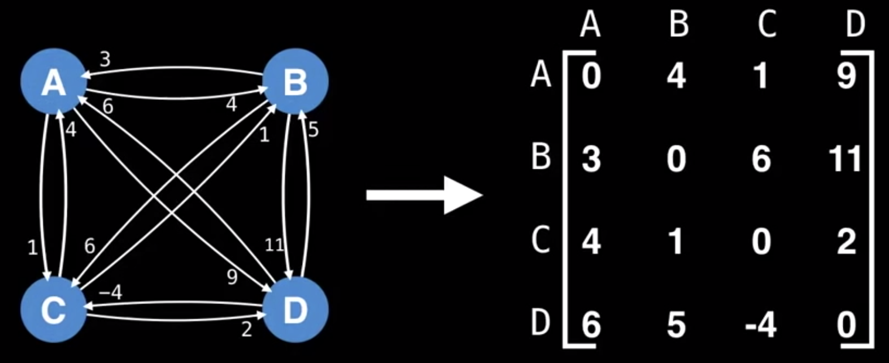

## Adjacency List
Maps nodes to list of edges

  | Pros          | Cons          |
  | :------------- |:------------- |
  | Space efficient for representing **sparse** graphs | Less space efficient for **denser** graphs |
  | Iterating over all the edges is efficient | Edge weight lookup is `O(E)` |
  | | Slightly more complex graph representation |

  *> Adjacency List*
  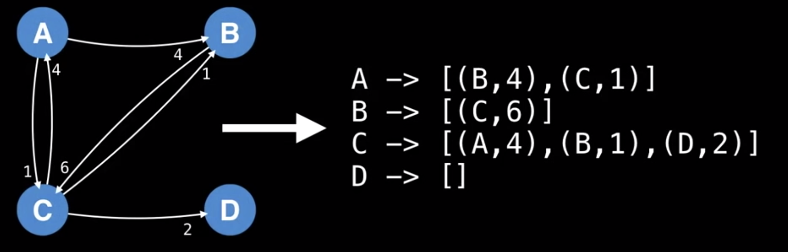

## Edge List
Unordered list of edges. Assume the notation for any triplet `(u,v,w)` means: "The cost from node `u` to node `v` is `w`".
   - This is seldomly used because of its lack of structure. However its simplicity may garner practical usecases in a handful of algorithms.

   *> Edge List*
   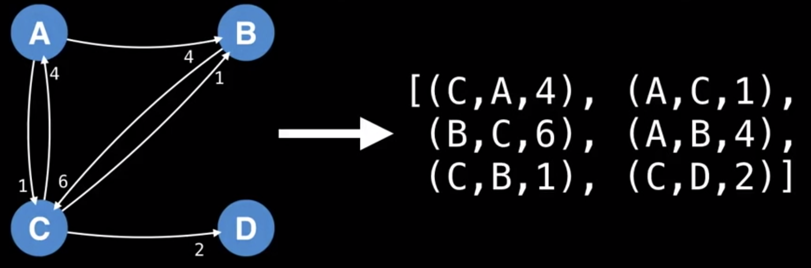

  | Pros          | Cons          |
  | :------------- |:------------- |
  | Space efficient for representing **sparse** graphs | Less space efficient for **denser** graphs |
  | Iterating over all the edges is efficient | Edge weight lookup is `O(E)` |
  | Very simple structure | |

# Common Graph Theory Problems
Common starter question when analyzing a problem:
- Is the graph undirected or directed?
- Are the edges weighted?
- Is the graph I will encounter likely to be sparse or dense with edges?
- Should I use an adjacency matrix, adjacency list, edge list, or other structure to represent the graph efficiently.

## Shortest Path Problem
Given a weighted graph, find the shortest path of edges from node `A` to node `B`
- Related algorithsm: BFS (unweighted graph), Dijkstra's, Bellman-Ford, Floyd-Warshall, A*

  *> Given*
  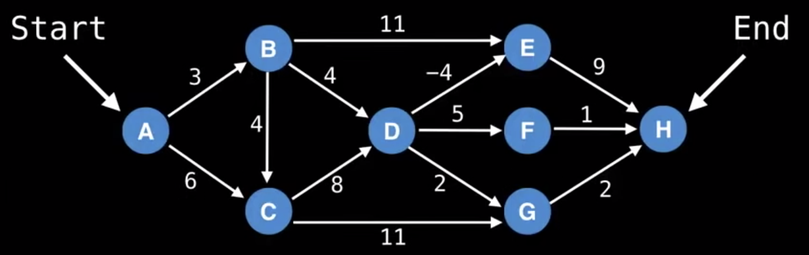

  *> Shortest Path*
  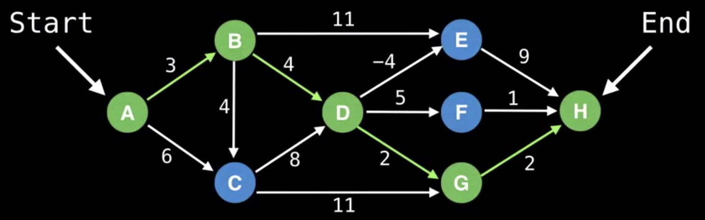


## Connectivity
Does there exist a path between node `A` and node `B`?
- We don't care about the cost, just wish to find whether one node is connected to another node.
- Related algorithms: Union-Find data structure or any search algorithm (e.g. DFS).

## Negative Cycles
Does my weighted digraph have any negative cycle? If so, where?
- Related algorithms: Bellman-Ford & Floyd-Marshall

  *> Negative Cycle(s)*
  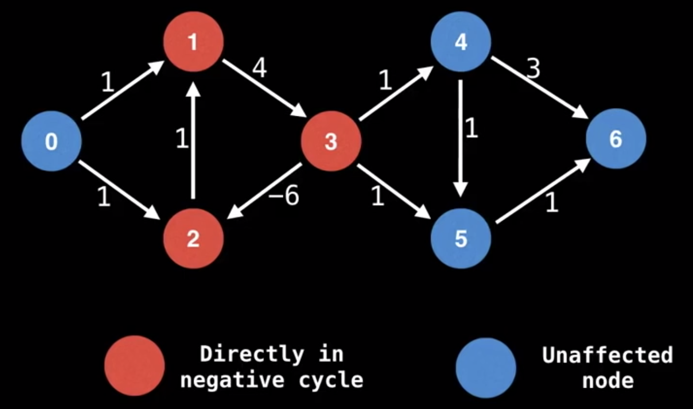


## Strongly Connected Components (SCCs)
These can be thought of as **self-contained cycles** within a **directed graph** where every vertex in a given cycle can reach every other vertex in the same cycle.
- This is typically an *intermediate* step as part of a larger algorithm
- Related algorithms: Tarjan's and Kosaraju's algorithm

  *> Strongly Connected Commponents*
  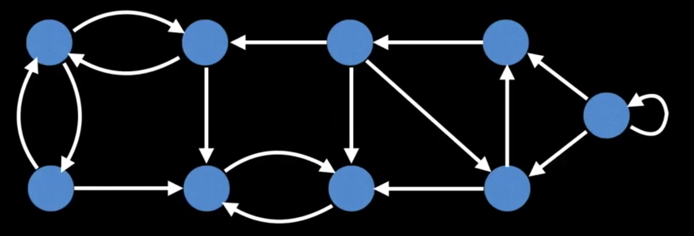
  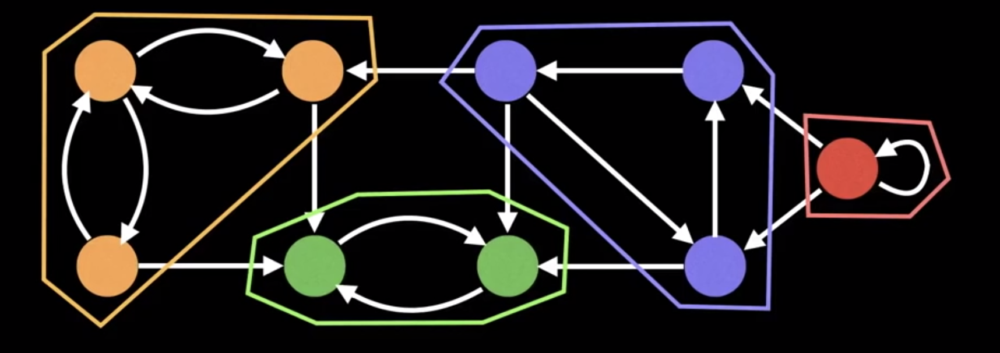


## Traveling Salesman Problem
"Given a list of cities and the distances between each pair of cities, what is the shortest possible route that visits each city exactly once and returns to the origin city?"
- This problem is considered **NP-Hard** meaning it's a very computationally challenging problem.
- Related algorithsm: Held-Karp, branch and bound and many approximation algorithms

  *> Traveling Salesman Problem*
  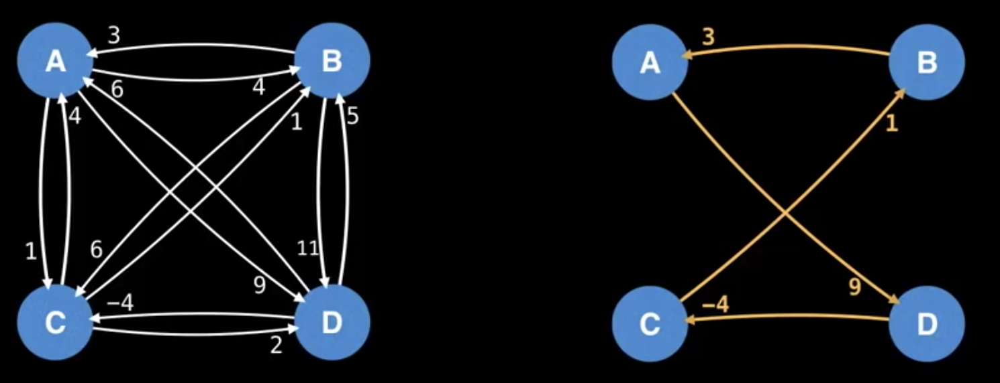


## Bridges
A *bridge / cut edge* is any **edge** in a graph whose removal increases the number of connected components.
> Note: These often hint at weak points, bottlenecks or vulnerabilites in a graph

  *> Bridges*
  


## Articulation Points
An *articulation point / cut vertex* is any **node** in a graph whose removal increase the number of connected components
> Note: These often hint at weak points, bottlenecks or vulnerabilites in a graph

  *> Articulation Points*
  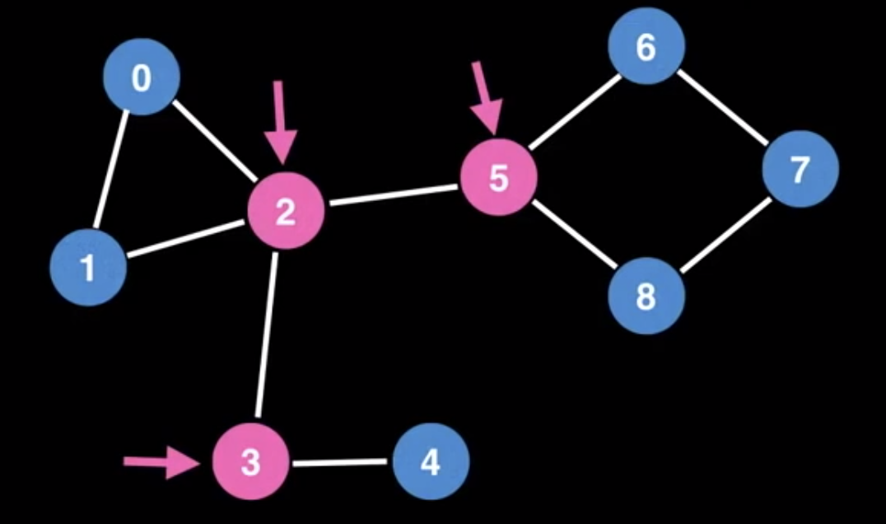


## Minumum Spanning Tree (MST)
MST is a subset of the edges of a connected, edge-weighted graph that connects all the vertices together, without any cycles and with the minimum possible total edge weight. 
- Common usecases: Designing least-cost network, circuit design, transportation network
- Related algorithms: Kruskal's, Prim's & Boruvka's algorithsm

  *> Given*
  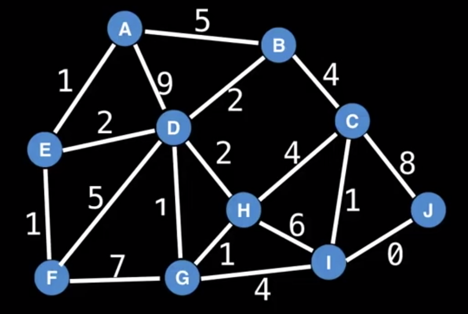

  *> Minimum Spanning Tree*
  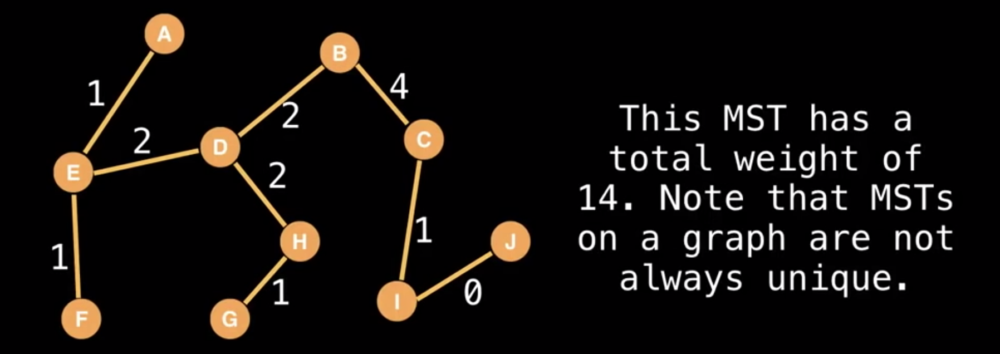


## Network Flow
With an infinite input source, how much "flow" can we push through the network?
- Example: Suppose the edges are roads with cars, pipes with water or hallways packed with people. Flow represents the volume of water to flow through the pipes, the number of cars the roads can sustain in traffic, and the maximum amount of people that can navigate through the hallways.
- Related Algorithsm: For-Fulkerson, Edmonds-Karp & Dinic's algorithm

  *> Network Flow*
  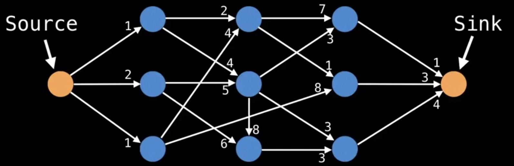